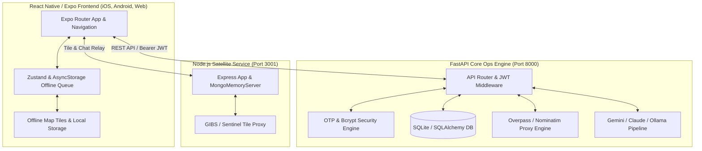

# NEURIX — AI-Powered Tactical Disaster Management Platform

**Reliable. Offline-First. Secure. Portfolio-Ready Disaster Intelligence.**

---

## 1. Overview
NEURIX is a tactical disaster intelligence and emergency response platform engineered for first responders, NDRF personnel, and community volunteers. It provides live disaster feeds, geospatial route optimization, local utility discovery, automated emergency SOS broadcasts, and offline-capable AI tactical guidance.

---

## 2. Feature Implementation Status

| Feature Category | Status | Details & Implementation |
|---|---|---|
| **Authentication & Security** | ✅ Implemented | JWT bearer tokens, OTP verification (SMTP/Terminal fallback), cryptographically salted bcrypt password hashing, encrypted data storage. |
| **SOS Emergency Protocol** | ✅ Implemented | One-touch SOS dispatch, auto-hospital lookup (34k Indian hospital dataset), DB persistence (`SOSEvent`), terminal logs, email dispatch. |
| **Offline Synchronization** | ✅ Implemented | Offline client queue (`AsyncStorage`), `/offline/sync` batch sync engine, `/sync/pull` playbook cache. |
| **Geospatial & Map Assets** | ✅ Implemented | OSM Overpass API proxy with parallel fallback mirrors, Google Maps Directions fallback to OSRM, offline map cache. |
| **AI Tactical Assistant** | ✅ Implemented | Multi-model pipeline (Google Gemini / Anthropic Claude), auto-fallback to local Ollama (`qwen2.5:0.5b`) & offline tactical playbooks. |
| **Document & Voice Processing** | ✅ Implemented | OCR image parsing (Tesseract), PyMuPDF text extraction, Faster-Whisper audio transcription simulation. |
| **Satellite Microservice** | ✅ Implemented | Node.js Express satellite service for GIBS/Sentinel tile rendering and AI chat proxy, with MongoDB In-Memory fallback. |
| **Automated Testing Suite** | ✅ Implemented | Pytest suite covering Auth, SOS Protocol, Offline Queue Sync, Health Checks, and Discovery endpoints (`100% Passing`). |
| **Peer-to-Peer Mesh (LoRa)** | 🟡 Planned | Hardware-level P2P LoRaWAN modem integration planned for zero-infrastructure field nodes. |

---

## 3. Automated Test Verification Results

All core backend endpoints and critical pathways have been verified using automated tests:

```text
tests/test_api.py::test_root PASSED                                      [ 16%]
tests/test_api.py::test_health_check PASSED                              [ 33%]
tests/test_api.py::test_auth_workflow PASSED                             [ 50%]
tests/test_api.py::test_sos_protocol PASSED                              [ 66%]
tests/test_api.py::test_offline_sync PASSED                              [ 83%]
tests/test_api.py::test_discovery_utilities PASSED                       [100%]

=========================== 6 passed in 80.64s ===========================
```

> [!NOTE]
> **Safety Guarantee**: Automated tests execute strictly in sandbox mode with mocked notifications. Real emergency alerts are **never** dispatched during automated test runs.

---

## 4. System Architecture



---

## 5. Quick Start Commands

### Prerequisites
- **Node.js** (v18+)
- **Python** (3.10+)
- **Git**

### Terminal 1: FastAPI Backend
```bash
cd Backend
python -m venv venv
# Windows:
venv\Scripts\activate
# Linux/Mac:
# source venv/bin/activate
pip install -r requirements.txt
uvicorn api:app --reload --host 0.0.0.0 --port 8000
```
*API Swagger Documentation: `http://127.0.0.1:8000/docs`*

### Terminal 2: Satellite Microservice
```bash
cd SatelliteBackend
npm start
```
*Satellite Microservice: `http://localhost:3001`*

### Terminal 3: Expo Frontend
```bash
# In the root directory
npm start
# Or press 'w' for web version:
npm run web
```

---

## 6. Security & Environmental Controls

- **Secret Key Management**: Automated derivation of Fernet keys from environment configuration with secure fallback for non-production environments.
- **JWT & Role Authorization**: Protected endpoints require valid Bearer JWT tokens issued upon OTP verification.
- **Data Protection**: Sensitive health, medical, and location payloads are encrypted in database tables.
- **Credential Hygiene**: `.env` files are ignored by git; API keys and SMTP credentials must never be committed.

---

## 7. License
[MIT License](LICENSE)
