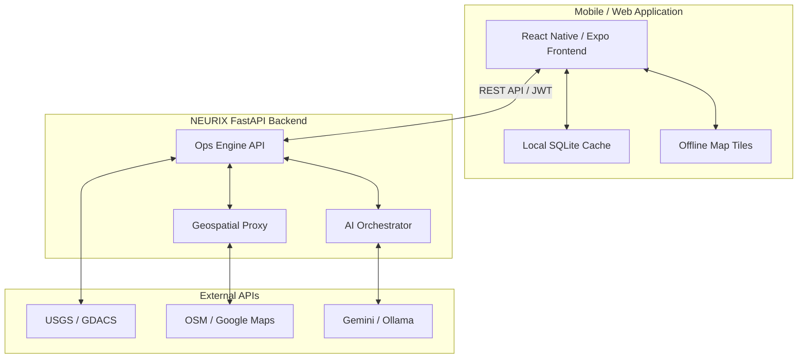

# NEURIX

**AI-Powered Offline-First Disaster Management Platform**

## 1. Overview
NEURIX is a tactical disaster intelligence and emergency response platform built for first responders, NDRF personnel, and community volunteers. It provides real-time disaster alerts, geospatial routing, local utility discovery, and AI-powered survival guidance. The platform is designed with an offline-first architecture, ensuring that critical operations can continue even when connectivity is compromised.

## 2. Problem Statement
During natural disasters (earthquakes, floods, cyclones), communication infrastructure often fails. First responders and victims are left without internet access, making it difficult to coordinate rescue efforts, find nearby medical facilities, or receive actionable survival guidance. Traditional cloud-dependent applications become useless in these zero-connectivity environments.

## 3. Solution
NEURIX bridges this gap by functioning as a highly resilient, offline-first tactical node. By utilizing local databases (SQLite), cached geospatial map tiles, and offline-capable AI models (via local Ollama endpoints), the platform delivers critical situational awareness and automated standard operating procedures (SOPs) regardless of internet availability. When online, it syncs with global data sources (USGS, GDACS, OSM) to provide a rich, unified tactical map.

## 4. Key Features
- **Offline-First Resilience:** Continuous operation without internet using local SQLite databases and cached map tiles.
- **Real-Time Global Ingestion:** Automated fetching of disaster events via USGS and GDACS.
- **Geospatial Discovery:** Locates nearby hospitals, pharmacies, and water sources using OSM and Google Places.
- **Tactical AI Assistant:** Multi-model AI chat providing triage and survival guidance.
- **Secure Operator Authentication:** JWT-based access with email OTP verification.
- **Resilient Routing:** Computes emergency routes via Google Directions with OSRM fallback.

## 5. Actual Implemented Features
- Cross-platform mobile frontend (iOS/Android/Web) built with React Native and Expo.
- FastAPI backend serving AI integrations, user management, and geospatial proxying.
- Integration with USGS Earthquake and GDACS RSS feeds for live global disaster alerts.
- Hospital and utility discovery using OpenStreetMap (Overpass API) and Google Maps APIs.
- AI Chat utilizing Google Gemini / Anthropic Claude, falling back to local Ollama.
- Offline playbooks and local database persistence for caching disaster data.
- User authentication flow using JWTs and OTPs via SMTP (Gmail).
- OCR (Tesseract) and PDF (PyMuPDF) text extraction capabilities on the backend.

## 6. System Architecture


## 7. How NEURIX Works
1. **Deployment:** Responders log into the app via OTP verification.
2. **Synchronization:** The app pulls the latest global disaster alerts and local utility data when online.
3. **Execution:** In the field, responders use the app to view alerts, query offline playbooks, and calculate routes to hospitals.
4. **AI Assistance:** Responders interact with the AI assistant for triage guidance; the backend routes requests to cloud AI or a local Ollama instance depending on connectivity.

## 8. Tech Stack
- **Frontend:** React Native, Expo, React Navigation, NativeWind, Zustand, Mapview.
- **Backend:** Python, FastAPI, SQLAlchemy, SQLite, Uvicorn, Passlib (JWT).
- **AI Integrations:** Google Gemini, Anthropic Claude, Ollama (Local).
- **Geospatial/Mapping:** React Native Maps, Overpass API, Google Maps API, OSRM.

## 9. Project Structure
```
NEURIX/
├── app/                  # React Native (Expo Router) screens and layouts
├── components/           # Reusable UI components
├── hooks/                # Custom React hooks
├── constants/            # Theming and styling constants
├── assets/               # Images and static assets
├── Store/                # Zustand state management
├── Backend/              # FastAPI Python backend
│   ├── core/             # Configuration, security, email, offline logic
│   ├── db/               # SQLAlchemy models and database setup
│   └── api.py            # Main API router and endpoints
├── SatelliteBackend/     # Node.js service for optional map tiling
├── scripts/              # Utility scripts
├── .env.example          # Environment variables template
├── package.json          # Node dependencies
└── tsconfig.json         # TypeScript configuration
```

## 10. Installation
### Prerequisites
- Node.js (v18+)
- Python 3.10+
- Expo CLI
- Git

### Clone the Repository
```bash
git clone https://github.com/404RUPSAfound/NEURIX.git
cd NEURIX
```

## 11. Environment Setup
1. Copy the example `.env` file in the root directory:
   ```bash
   cp .env.example .env
   ```
2. Navigate to the `Backend` directory and setup its environment variables:
   ```bash
   cd Backend
   cp .env.example .env
   ```
3. Update the `.env` files with your actual API keys (Gemini, SMTP, Google Maps).

## 12. Frontend Setup
1. From the project root, install Node dependencies:
   ```bash
   npm install
   ```

## 13. Backend Setup
1. Navigate to the `Backend` directory:
   ```bash
   cd Backend
   ```
2. Create and activate a virtual environment:
   ```bash
   python -m venv venv
   source venv/bin/activate  # On Windows use: venv\Scripts\activate
   ```
3. Install Python dependencies:
   ```bash
   pip install -r requirements.txt
   ```

## 14. Running the Application
**Start the Backend:**
```bash
cd Backend
source venv/bin/activate
uvicorn api:app --reload --host 0.0.0.0 --port 8000
```

**Start the Frontend:**
Open a new terminal in the project root:
```bash
npx expo start
```
You can press `a` for Android, `i` for iOS, or `w` for Web.

## 15. API Overview
The FastAPI backend exposes endpoints primarily documented via Swagger UI. Once the backend is running, visit `http://localhost:8000/docs` to see:
- `POST /auth/register`: Operator node registration.
- `POST /auth/verify-otp`: OTP verification.
- `POST /auth/login`: Issue JWT token.
- `GET /api/discovery/utilities`: Fetch local real-world utilities (shops, water, etc.).
- `POST /api/ops/proxy`: Geospatial proxy for Overpass/Nominatim.

## 16. Offline Architecture
NEURIX achieves offline resilience by caching critical information:
- The React Native app utilizes SQLite and AsyncStorage to store recently fetched disaster reports and utility data.
- The AI backend routes fallback queries to a locally hosted Ollama instance when cloud APIs are unreachable.
- OpenStreetMap and Google Maps routes can be cached locally for active missions.

## 17. AI Integration
- **Triage & Guidance:** Responders can interact with an AI orchestrator capable of analyzing symptoms and disaster contexts.
- **Failover Logic:** The backend seamlessly fails over from Google Gemini/Claude to a local Ollama model if external internet goes down, ensuring zero downtime for critical intel.

## 18. Screenshots
*(Placeholder - Replace with actual 4-6 screens of the application)*
1. Login & OTP Verification
2. Global Disaster Radar Map
3. Tactical Feed & Alerts
4. Local Hospital & Utility Discovery
5. AI Emergency Assistant

## 19. Future Scope
- **Bluetooth Mesh & Wi-Fi Direct:** Implement true P2P device-to-device communication for zero-infrastructure networking.
- **Automated Drone Sync:** Live ingestion of drone video feeds for AI anomaly detection.
- **Satellite Hardware Integrations:** LoRaWAN and Iridium satellite modem support for extreme remote connectivity.

## 20. Limitations
- True peer-to-peer mesh networking is currently simulated in the UI and requires hardware-level implementation in future updates.
- Offline map tiles require pre-caching the area of operation before losing connectivity.

## 21. Security Considerations
- **No Hardcoded Secrets:** All sensitive API keys and SMTP credentials must remain in `.env` files and are ignored by git.
- **Authentication:** All mission endpoints are protected by JWT tokens.
- **Data Privacy:** OTPs are transient and deleted upon verification. Passwords are cryptographically hashed using Passlib.

## 22. Disclaimer
This software is intended as an informational tool and should not be solely relied upon for life-or-death decision-making without proper human operational oversight.

## 23. License
[MIT License](LICENSE)
