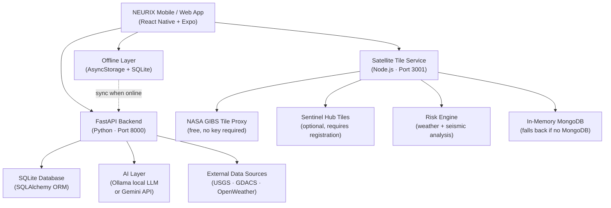

# NEURIX

**AI-Powered Offline-First Disaster Management Platform**

NEURIX is a cross-platform mobile and web application built for emergency responders, volunteers, and disaster-affected communities. It provides AI-assisted situational awareness, field coordination tools, community reporting, and emergency SOS capabilities — all designed to function even when internet connectivity is unavailable.

> **Project Status:** Active Development — Prototype / Portfolio Project.
> Not a production emergency system. See [Disclaimer](#disclaimer).

---

## Table of Contents

- [Overview](#overview)
- [Problem Statement](#problem-statement)
- [Solution](#solution)
- [Key Features](#key-features)
- [System Architecture](#system-architecture)
- [How It Works](#how-it-works)
- [Tech Stack](#tech-stack)
- [Project Structure](#project-structure)
- [Installation](#installation)
- [Environment Setup](#environment-setup)
- [Running the Application](#running-the-application)
- [API Overview](#api-overview)
- [Offline Architecture](#offline-architecture)
- [AI Integration](#ai-integration)
- [Screenshots](#screenshots)
- [Future Scope](#future-scope)
- [Limitations](#limitations)
- [Disclaimer](#disclaimer)
- [License](#license)

---

## Overview

NEURIX is an Expo / React Native application backed by a Python FastAPI server and a Node.js satellite tile microservice. It enables field responders and affected citizens to:

- Report and analyze disaster situations via AI
- View real-time and cached map layers
- Access offline tactical response playbooks
- Manage victim triage, resource inventory, and relief distribution
- Trigger SOS events with GPS coordinates
- Coordinate via community pins and community status updates
- Track field units on a tactical recon screen

---

## Problem Statement

During large-scale disasters — floods, earthquakes, cyclones — standard communication infrastructure frequently fails. Internet connectivity drops. Cellular towers go down. Emergency responders lose situational awareness at the moment they need it most.

Existing emergency apps assume connectivity and stop working when it is lost.

---

## Solution

NEURIX is built offline-first. It caches tactical playbooks, map data, and prior analysis locally using AsyncStorage and SQLite. When connectivity is restored, it syncs pending records back to the backend automatically.

The system uses a local LLM (Ollama) for on-device AI chat and can fall back to Gemini (Google) when online.

---

## Key Features

| Feature | Description |
|---|---|
| **Offline Tactical Playbooks** | Pre-loaded response plans for floods, earthquakes, cyclones, fires, and landslides available with zero connectivity |
| **AI Situation Analysis** | Submit a disaster scenario and receive structured action cards, timeline, and resource recommendations |
| **AI Chat (NEURIX Command AI)** | Tactical assistant powered by a local Ollama LLM, grounded with live weather and risk telemetry |
| **Disaster Reports** | Submit and track disaster events with severity, location, GPS, and AI-generated SOP suggestions |
| **Victim Triage** | Field triage scoring (RED / YELLOW / GREEN tags) with data stored locally and synced to backend |
| **SOS / Emergency Trigger** | One-tap SOS that records GPS coordinates and can email emergency contacts |
| **Hospital Locator** | Nearby hospital discovery using an embedded India hospital dataset with bed/ICU status |
| **Resource Inventory** | Track field resources (boats, kits, personnel) with status: OK / LOW / CRITICAL |
| **Relief Distribution Log** | Record beneficiary relief distribution with ID verification |
| **Community Pins** | Crowd-sourced hazard markers (roadblocks, flood zones, landslides) on the map |
| **Community Updates** | Utility status reporting (electricity, water, medical availability) |
| **Tactical Recon Screen** | Visual field unit tracking with status, battery, and GPS normalization |
| **Map View** | Interactive map with disaster overlays, community pins, hospital markers, and blocked roads |
| **Satellite Tile Service** | NASA GIBS tile proxy (free, no API key) and optional Sentinel-2 tile layer |
| **Document / Voice Scan** | Upload images or audio files for AI-assisted extraction of field intelligence |
| **Offline Sync Queue** | Local records queued during outages and automatically pushed to backend when connectivity returns |
| **JWT Authentication** | Secure registration with email OTP verification, bcrypt password hashing, and JWT tokens |
| **Blockchain-style Audit Log** | SHA-256 chained event log for tamper-evident tracking of tactical operator actions |
| **Route Status Tracking** | Field-reported road blockages with alternatives |
| **Report History** | Per-user archive of all submitted disaster analyses |

---

## System Architecture



---

## How It Works

1. **On launch** — The app checks network connectivity via `@react-native-community/netinfo`.
2. **Online mode** — Fetches live disaster data, weather, map assets, and AI analysis from the FastAPI backend.
3. **Offline mode** — Falls back to locally cached playbooks stored in `Store/offlineEngine.ts`. Any analysis or triage submissions are queued in AsyncStorage.
4. **Background sync** — When connectivity returns, `syncManager.pushOfflineQueue()` pushes pending records to `/offline/sync`.
5. **AI analysis** — Submitting a scenario posts to `/analyze`. The backend calls the local Ollama LLM if available, otherwise falls back to the Gemini API.
6. **SOS** — The SOS trigger posts to `/api/ops/sos` with GPS coordinates and optional medical metadata. An email alert is dispatched via Gmail SMTP.
7. **Sentinel background task** — The FastAPI server runs an async background task that syncs earthquake data from USGS and global alerts from GDACS every 5 minutes.

---

## Tech Stack

### Frontend
| Technology | Purpose |
|---|---|
| React Native 0.81 | Cross-platform mobile and web UI |
| Expo SDK 54 | Build toolchain, native modules |
| Expo Router 6 | File-based navigation |
| Zustand 5 | Global state management |
| NativeWind / TailwindCSS | Utility-first styling |
| AsyncStorage | Local offline data persistence |
| expo-sqlite | Local relational database |
| expo-location | GPS coordinate access |
| expo-camera / expo-image-picker | Photo capture for field reports |
| expo-secure-store | Secure JWT token storage |
| axios | HTTP client with auth interceptors |

### Backend (Python / FastAPI)
| Technology | Purpose |
|---|---|
| FastAPI 0.115 | REST API framework |
| SQLAlchemy 2.0 | ORM for SQLite |
| SQLite | Local persistent database |
| Passlib + bcrypt | Password hashing |
| python-jose | JWT creation and verification |
| cryptography (Fernet) | Field data encryption at rest |
| slowapi | Rate limiting |
| Loguru | Structured logging |
| Ollama (local) | Offline LLM inference |
| Google Gemini API | Cloud AI fallback |
| Anthropic Claude API | Optional cloud AI fallback |
| Pytesseract + OpenCV | Document OCR scanning |
| faster-whisper | Voice transcription |
| PyMuPDF | PDF document processing |
| googlemaps | Routing and geocoding |
| reportlab | PDF report generation |

### Satellite / Tile Service (Node.js)
| Technology | Purpose |
|---|---|
| Express 5 | HTTP server |
| Mongoose + MongoDB | Alert storage (in-memory fallback) |
| node-cache | Tile caching |
| node-cron | Scheduled data refresh |
| Ollama (via axios) | Local LLM for tactical chat |
| NASA GIBS | Free satellite imagery tiles |
| Sentinel Hub | Optional Sentinel-2 tiles |
| OpenWeatherMap | Weather data for risk engine |
| USGS Earthquake API | Seismic data |

---

## Project Structure

```
NEURIX/
|
+-- app/                        # Expo Router screens (file-based routing)
|   +-- (tabs)/                 # Bottom tab screens
|   |   +-- index.tsx           # Home / Dashboard
|   |   +-- chat.tsx            # AI Chat (NEURIX Command AI)
|   |   +-- community.tsx       # Community reports & pins
|   |   +-- explore.tsx         # Disaster exploration
|   |   +-- history.tsx         # Analysis history
|   |   +-- map.web.tsx         # Map view (web)
|   |   +-- more.tsx            # Settings & utilities
|   |   +-- profile.tsx         # User profile
|   |   +-- recon.native.tsx    # Tactical recon screen (native)
|   |   +-- report.tsx          # Disaster report submission
|   +-- auth.tsx                # Registration & login flow
|   +-- otp-verify.tsx          # OTP verification
|   +-- triage.tsx              # Victim triage
|   +-- resources.tsx           # Resource inventory
|   +-- relief.tsx              # Relief distribution log
|   +-- hospitals_detail.tsx    # Hospital status detail
|   +-- alerts_detail.tsx       # Alert detail view
|   +-- results.tsx             # Analysis results
|   +-- processing.tsx          # Analysis processing screen
|   +-- splash.tsx              # Splash screen
|
+-- components/                 # Reusable UI components
|   +-- ReconView.native.tsx    # Tactical map for native
|   +-- ReconView.tsx           # Tactical map for web
|   +-- PriorityCard.tsx        # Action card component
|   +-- ConfidenceBox.tsx       # AI confidence indicator
|   +-- TacticalStatus.tsx      # Field unit status badge
|   +-- MissionAssets.tsx       # Asset summary panel
|   +-- FieldControls.tsx       # Field action controls
|   +-- Skeleton.tsx            # Loading skeleton
|   +-- ui/                     # Base UI primitives
|
+-- Store/                      # State management & API layer
|   +-- api.ts                  # All API calls (axios)
|   +-- offlineEngine.ts        # Offline tactical playbooks
|   +-- reconEngine.ts          # Recon unit state hook
|   +-- realData.ts             # Real-data store
|
+-- constants/                  # App-wide constants
|   +-- api.ts                  # Platform-aware API base URL
|   +-- Colors.ts               # Color palette
|   +-- design.ts               # Design system tokens
|   +-- theme.ts                # Theme configuration
|
+-- hooks/                      # Custom React hooks
|   +-- use-color-scheme.ts     # Color scheme detection
|   +-- use-theme-color.ts      # Theme color resolution
|
+-- assets/                     # Static assets (images, icons)
|
+-- Backend/                    # Python FastAPI backend
|   +-- api.py                  # Main API (all routes)
|   +-- core/
|   |   +-- config.py           # Settings (env-driven)
|   |   +-- security.py         # JWT, bcrypt, Fernet encryption
|   |   +-- email_utils.py      # Gmail SMTP email dispatch
|   |   +-- offline_intel.py    # Offline playbook data
|   |   +-- india_hospitals.py  # Hospital dataset handler
|   +-- db/
|   |   +-- database.py         # SQLAlchemy engine + session
|   |   +-- models.py           # ORM models (14 tables)
|   +-- seed_data.py            # Initial data seeding
|   +-- seed_hospitals.py       # Hospital data seeding
|   +-- requirements.txt        # Python dependencies
|   +-- .env.example            # Environment variable template
|
+-- SatelliteBackend/           # Node.js satellite tile service
|   +-- app.js                  # Express server entry point
|   +-- routes/
|   |   +-- tileRoutes.js       # Satellite tile proxy routes
|   |   +-- disasterRoutes.js   # Disaster intelligence routes
|   +-- services/
|   |   +-- openaiService.js    # Ollama local LLM chat
|   |   +-- riskEngine.js       # Weather + seismic risk analysis
|   |   +-- earthquakeService.js# USGS earthquake data
|   |   +-- weatherService.js   # OpenWeatherMap integration
|   |   +-- nasaService.js      # NASA GIBS tile proxy
|   |   +-- sentinelService.js  # Sentinel Hub tile proxy
|   |   +-- scheduler.js        # Background data refresh cron
|   +-- models/                 # Mongoose models
|   +-- config/                 # Server configuration
|   +-- utils/                  # Logger, cache utilities
|   +-- package.json
|   +-- .env.example            # Environment variable template
|
+-- scripts/                    # Utility scripts
|   +-- reset-project.js        # Expo project reset helper
|
+-- .env.example                # Frontend env template
+-- .gitignore
+-- README.md
+-- RUN_GUIDE.md
+-- app.json                    # Expo configuration
+-- package.json
+-- tsconfig.json
+-- babel.config.js
+-- metro.config.cjs
+-- tailwind.config.js
+-- start_neurix.bat            # Windows multi-service launcher
```

---

## Installation

### Prerequisites

| Requirement | Version |
|---|---|
| Node.js | 18+ |
| Python | 3.10+ |
| Expo Go (mobile testing) | Latest |
| Ollama (optional, for offline AI) | Latest |

### Clone the Repository

```bash
git clone https://github.com/404RUPSAfound/NEURIX.git
cd NEURIX
```

---

## Environment Setup

### Frontend (root `.env`)

```bash
cp .env.example .env
```

Edit `.env`:

```env
EXPO_PUBLIC_API_URL=http://127.0.0.1:8000
EXPO_PUBLIC_SATELLITE_API_URL=http://127.0.0.1:3001
```

### Backend (`Backend/.env`)

```bash
cp Backend/.env.example Backend/.env
```

Edit `Backend/.env` and fill in:
- `GEMINI_API_KEY` — from [Google AI Studio](https://aistudio.google.com/app/apikey)
- `SECRET_KEY` — any strong random string (e.g. `openssl rand -hex 32`)
- `GMAIL_SENDER` + `GMAIL_APP_PASSWORD` — for OTP email delivery (optional)

### Satellite Backend (`SatelliteBackend/.env`)

```bash
cp SatelliteBackend/.env.example SatelliteBackend/.env
```

The tile service works without any API key (NASA GIBS is free). Sentinel Hub credentials are optional.

---

## Running the Application

All three services must run simultaneously in separate terminals.

### 1. FastAPI Backend (Port 8000)

```bash
cd Backend
python -m venv venv
venv\Scripts\activate        # Windows
# source venv/bin/activate   # macOS/Linux
pip install -r requirements.txt
uvicorn api:app --reload --port 8000
```

API docs available at: http://127.0.0.1:8000/docs

### 2. Satellite Tile Service (Port 3001)

```bash
cd SatelliteBackend
npm install
npm start
```

Health check: http://localhost:3001/health

### 3. Frontend (Expo)

```bash
# From the project root
npm install
npx expo start
```

- Press `w` to open in browser
- Scan QR with Expo Go for Android/iOS

### Windows Quick Start

```bash
start_neurix.bat
```

This launches all three services in separate terminal windows automatically.

### Optional: Offline AI (Ollama)

```bash
# Install from https://ollama.ai
ollama pull qwen2.5:0.5b
ollama serve
```

---

## API Overview

The FastAPI backend exposes the following route groups:

| Route | Method | Description |
|---|---|---|
| `/auth/register` | POST | User registration with OTP email |
| `/auth/verify-otp` | POST | OTP verification and account activation |
| `/auth/login` | POST | JWT token login |
| `/analyze` | POST | AI disaster situation analysis |
| `/replan` | POST | Update existing analysis with new info |
| `/history` | GET | User analysis history |
| `/api/map/nearby` | GET | Nearby assets (hospitals, units, disasters) |
| `/api/dashboard/stats` | GET | Dashboard statistics |
| `/api/ops/sos` | POST | SOS trigger with GPS |
| `/api/ops/deploy-unit` | POST | Deploy a field unit |
| `/api/ops/units` | GET | Live field unit positions |
| `/api/community/pins` | POST/GET | Community hazard pins |
| `/api/community/updates` | POST/GET | Community utility status |
| `/medical/triage` | POST/GET | Victim triage records |
| `/hospitals/update_beds` | POST | Update hospital bed status |
| `/medical/route` | POST | Smart hospital routing by triage tag |
| `/api/scan/document` | POST | OCR document scan |
| `/api/scan/voice` | POST | Voice transcription |
| `/offline/sync` | POST | Sync offline-queued records |
| `/api/weather` | GET | Weather data for a GPS location |
| `/api/ops/proxy` | POST | Tactical proxy (Overpass / USGS / Nominatim) |

Full interactive documentation: **http://127.0.0.1:8000/docs**

---

## Offline Architecture

NEURIX degrades gracefully when connectivity is lost:

```
Online  --> Backend API --> SQLite + AI analysis
              |
              +--> AsyncStorage cache written on every successful response
              |
Offline --> AsyncStorage cache read first
              +--> Tactical playbooks (offlineEngine.ts) served immediately
              +--> Triage/Relief records queued to offline_history_queue
              +--> On reconnect: syncManager.pushOfflineQueue() syncs pending records
```

**Offline playbooks cover:**
- Flash Flood
- Earthquake
- Cyclone / Storm
- Wildfire
- Landslide

Each playbook includes: action cards (with priority, time, confidence), operational timeline, resource list, risk zones, safety guidelines, and role delegations.

---

## AI Integration

| Layer | Technology | When Used |
|---|---|---|
| **Disaster analysis** | Ollama (local) or Gemini API | When user submits a situation report |
| **Tactical chat** | Ollama (local, via SatelliteBackend) | NEURIX Command AI tab |
| **Risk engine** | Rule-based (riskEngine.js) | Automatic, based on weather + seismic data |
| **Document scan** | Tesseract OCR + OpenCV | Upload field documents for text extraction |
| **Voice scan** | faster-whisper | Upload audio for transcription |
| **Offline AI** | Static playbook lookup (offlineEngine.ts) | When both Ollama and Gemini are unavailable |

The AI chat system injects live telemetry (location, weather, risk level) into the system prompt. It also supports Hindi/Hinglish inputs.

---

## Screenshots

> Screenshots to be added.

---

## Future Scope

The following features are **planned but not yet implemented**:

- **True mesh networking** — Bluetooth or Wi-Fi Direct peer-to-peer relay between devices
- **Push notifications** — Real-time alerts via Expo Notifications or FCM
- **Android native build** — Full APK/AAB for Play Store deployment
- **Multi-language UI** — Hindi and regional language interface
- **Role-based access control** — Separate interfaces for commanders, volunteers, and citizens
- **Live GPS tracking map** — Real-time field unit positions on the map screen
- **Production cloud deployment** — Cloud hosting, CI/CD pipeline
- **Government / NDMA integration** — Data sharing with official disaster databases

---

## Limitations

- This is a **prototype** built for learning and portfolio demonstration
- The backend runs locally; there is no cloud deployment
- The hospital dataset is pre-seeded and does not reflect real-time bed availability
- Offline AI responses are rule-based playbooks unless Ollama is locally running
- The SOS email feature requires valid Gmail SMTP credentials in `.env`
- The satellite tile service requires internet for live imagery
- No automated test suite is currently included

---

## Disclaimer

**NEURIX is a personal portfolio and research project.**

It is **not** a production emergency response system. It has not been tested, certified, or approved for use in any actual disaster or emergency situation.

**In a real emergency, always contact:**
- **India Emergency**: 112
- **NDRF Helpline**: 011-24363260
- **Ambulance**: 108

---

## Suggested GitHub Topics

```
ai  disaster-management  emergency-response  react-native  expo
typescript  python  fastapi  offline-first  mobile-app  sqlite  ollama
```

---

## License

This project is released under the [MIT License](LICENSE).

---

*Built by [Rupsa Pandit](https://github.com/404RUPSAfound)*
